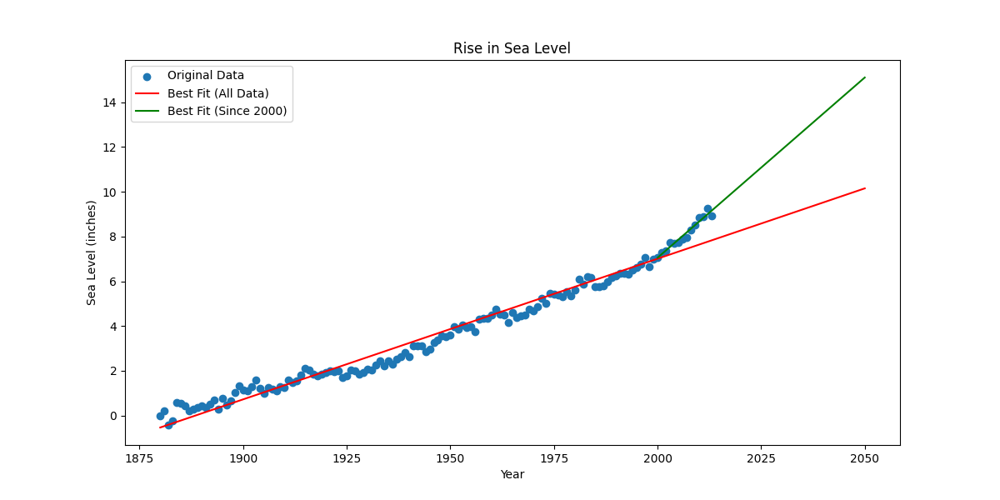

# Prediktor Kenaikan Permukaan Laut

Proyek ini menganalisis data historis perubahan permukaan laut global sejak tahun 1880 untuk memvisualisasikan tren dan memprediksi kenaikan di masa depan menggunakan regresi linear.

---
## Hasil Visualisasi

Plot di bawah ini menampilkan data historis sebagai titik-titik (scatter plot) beserta dua garis prediksi tren hingga tahun 2050. Garis merah menunjukkan tren jangka panjang, sedangkan garis hijau menunjukkan tren kenaikan yang lebih cepat sejak tahun 2000.

---
## Struktur File

* **`sea_level_predictor.py`**: Skrip utama untuk analisis dan pembuatan plot.
* **`main.py`**: Skrip untuk menjalankan analisis dan pengujian otomatis.
* **`test_module.py`**: Berisi unit test untuk validasi.
* **`epa-sea-level.csv`**: Dataset yang digunakan dalam analisis.

---
## Sumber Data

Dataset yang digunakan dalam analisis ini dapat diakses melalui link berikut:
[Sea Level Rise Data](https://datahub.io/core/sea-level-rise)
